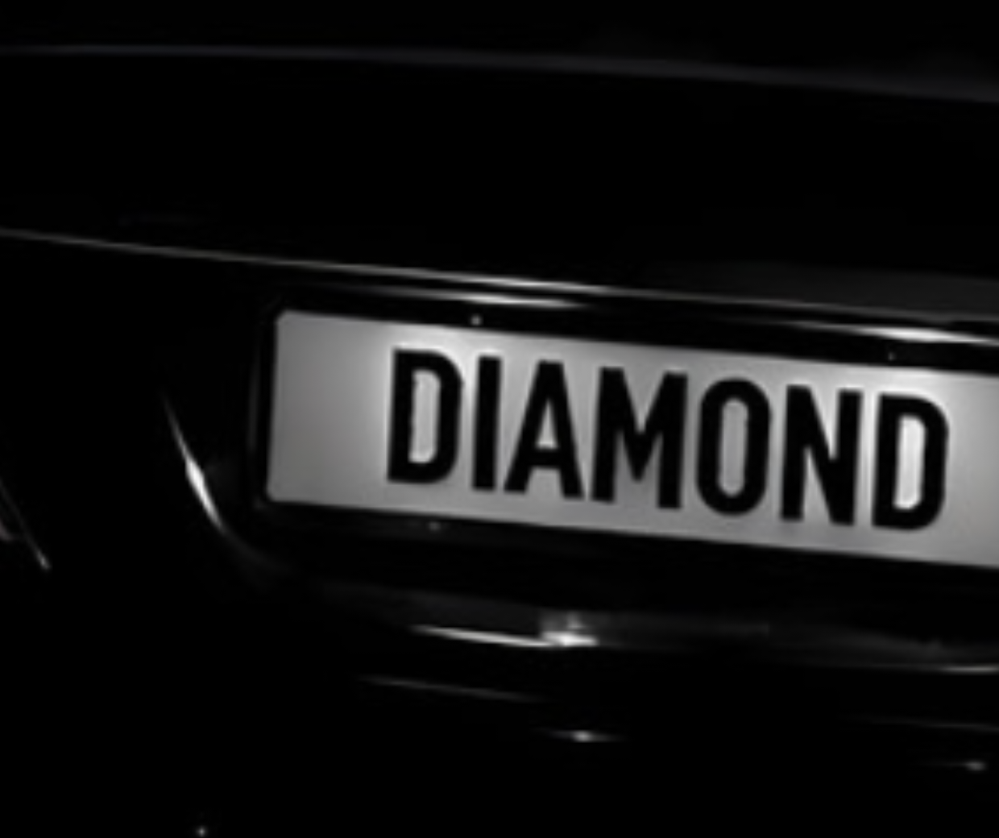
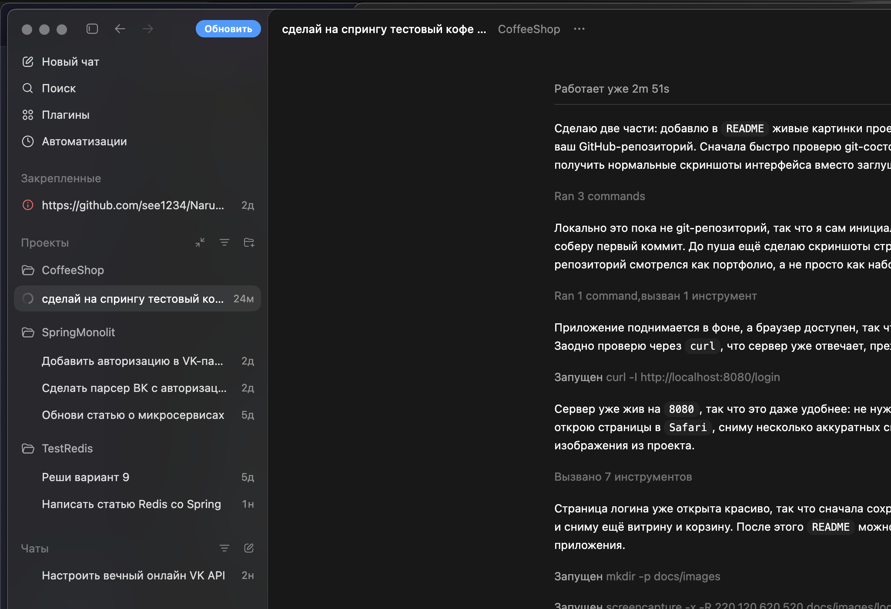
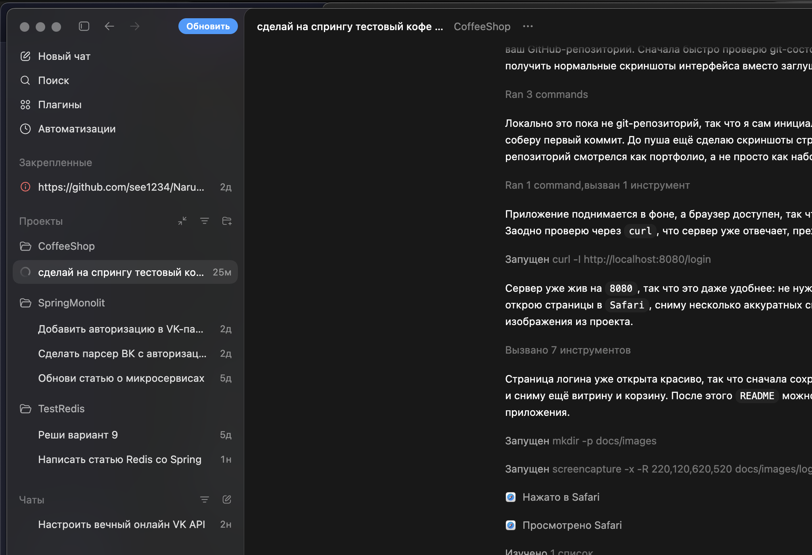

# Coffeshop

Портфолио-проект онлайн-кофейни на `Spring Boot`: каталог напитков и десертов, регистрация и вход пользователей, персональная корзина и аккуратный веб-интерфейс на `Thymeleaf`.

## Preview





## Что сделано

- спроектирован полноценный mini e-commerce сценарий для кофейни
- реализованы регистрация, вход и защита приватных страниц через `Spring Security`
- подключено хранение пользователей в `SQLite` вместо временной in-memory базы
- настроена корзина с хранением в пользовательской `HTTP`-сессии
- добавлен стартовый набор товаров с категориями, ценами и описаниями
- оформлен серверный интерфейс на `Thymeleaf` с единым визуальным стилем
- подготовлен репозиторий в виде портфолио-проекта с документацией и скриншотами

## О проекте

`Coffeshop` показывает базовый, но законченный сценарий e-commerce приложения:

- регистрация и авторизация через `Spring Security`
- хранение аккаунтов пользователей в `SQLite`
- каталог позиций с категориями и ценами
- корзина в рамках пользовательской сессии
- оформление тестового заказа с очисткой корзины
- серверный UI на `Thymeleaf` без перегруженного фронтенда

## Стек

- `Java 17+`
- `Spring Boot 3`
- `Spring Web`
- `Spring Security`
- `Spring Data JPA`
- `SQLite`
- `Thymeleaf`
- `Gradle`
- `JUnit 5`

## Возможности

### Аутентификация

- страница входа с формой логина и пароля
- регистрация новых пользователей
- пароли хранятся в зашифрованном виде через `BCrypt`
- приватные страницы доступны только после входа

### Витрина

- набор готовых позиций: классические кофейные напитки, десерты и выпечка
- карточки товаров с ценой и кратким описанием
- быстрое добавление товара в корзину

### Корзина

- хранится отдельно для каждой пользовательской сессии
- одинаковые товары агрегируются по количеству
- автоматически считается итоговая стоимость
- после оформления заказ очищается

## Архитектура

Проект разделен на простые слои:

- `config` — security и начальная инициализация данных
- `model` — сущности и доменные объекты
- `repository` — доступ к данным пользователей
- `service` — бизнес-логика каталога, аккаунтов и корзины
- `web` — MVC-контроллеры и формы
- `templates` — страницы на `Thymeleaf`
- `static/css` — стили интерфейса

## Быстрый старт

### 1. Запуск приложения

```bash
./gradlew bootRun
```

После запуска приложение будет доступно по адресу:

`http://localhost:8080`

### 2. Стартовый аккаунт

- логин: `manager`
- пароль: `coffee123`

Можно также зарегистрировать нового пользователя через страницу регистрации.

## Локальная база данных

Пользователи сохраняются в файл:

`coffeeshop.db`

Это делает проект удобным для демо и портфолио: аккаунты не пропадают после перезапуска, а база не требует отдельного сервера.

## Тесты

```bash
./gradlew test
```

В проекте уже есть базовые тесты на загрузку контекста и логику корзины.

## Что можно развить дальше

- оформление и хранение заказов в базе
- роли `ADMIN` и `USER`
- административную панель управления меню
- историю заказов пользователя
- оплату и интеграцию с внешним API доставки

## Почему этот проект хорошо смотрится в портфолио

- показывает работу с `Spring Security` и аутентификацией
- демонстрирует интеграцию `Spring Data JPA` с `SQLite`
- включает серверный рендеринг интерфейса и базовую UX-логику
- выглядит как законченный mini-product, а не набор разрозненных CRUD-экранов

## Репозиторий

GitHub: [see1234/CoffeeShop](https://github.com/see1234/CoffeeShop)
